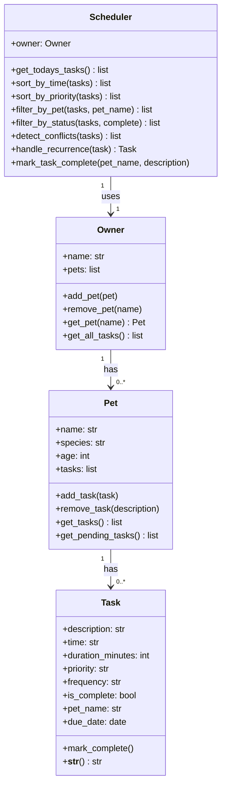

```mermaid
classDiagram
    class Task {
        +description: str
        +time: str
        +duration_minutes: int
        +priority: str
        +frequency: str
        +is_complete: bool
        +pet_name: str
        +due_date: date
        +mark_complete()
        +__str__() str
    }

    class Pet {
        +name: str
        +species: str
        +age: int
        +tasks: list
        +add_task(task)
        +remove_task(description)
        +get_tasks() list
        +get_pending_tasks() list
    }

    class Owner {
        +name: str
        +pets: list
        +add_pet(pet)
        +remove_pet(name)
        +get_pet(name) Pet
        +get_all_tasks() list
    }

    class Scheduler {
        +owner: Owner
        +get_todays_tasks() list
        +sort_by_time(tasks) list
        +sort_by_priority(tasks) list
        +filter_by_pet(tasks, pet_name) list
        +filter_by_status(tasks, complete) list
        +detect_conflicts(tasks) list
        +handle_recurrence(task) Task
        +mark_task_complete(pet_name, description)
    }

    Owner "1" --> "0..*" Pet : has
    Pet "1" --> "0..*" Task : has
    Scheduler "1" --> "1" Owner : uses
```
